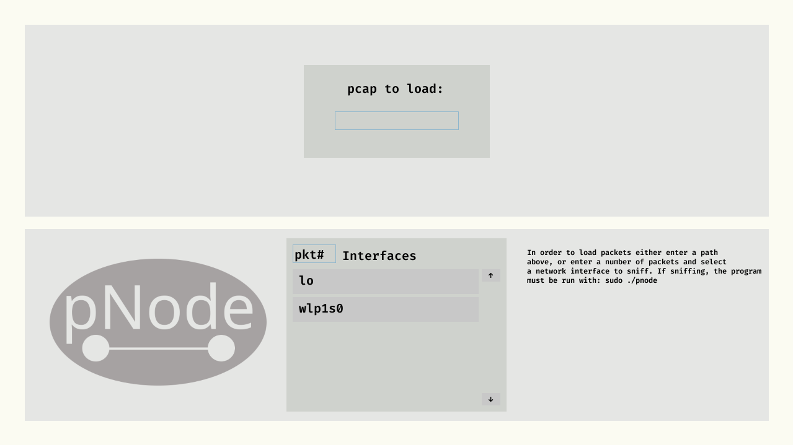
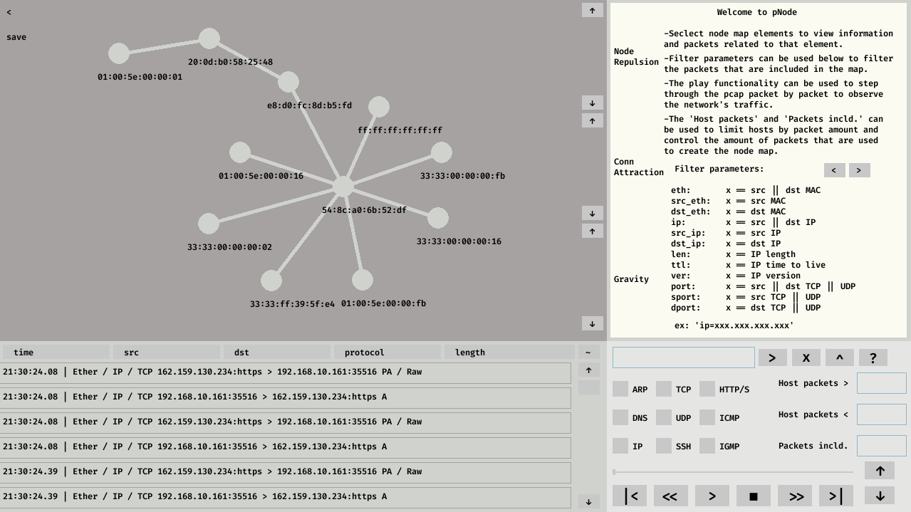

# pNode
pcap debugger that uses pcap packets to create a node map
that can be interacted with to portray information about
the host or connection.

V1.0
open packets up to ~20MB - even that kinda sucks, but smaller pcaps work quite well!
Packets can be filtered by fields defined below
Playthrough functionality allows user to step through pcap chronologically to see traffic
Filter hosts by packet amount

Packets can be filtered by the following parameters:
filt_parameters = 
- "eth:       x == src || dst MAC",
- "src_eth:   x == src MAC",
- "dst_eth:   x == dst MAC",
- "ip:        x == src || dst IP",
- "src_ip:    x == src IP",
- "dst_ip:    x == dst IP",
 -"len:       x == IP length",
 -"ttl:       x == IP time to live",
- "ver:       x == IP version",
- "port:      x == src || dst TCP || UDP",
- "sport:     x == src TCP || UDP",
- "dport:     x == dst TCP || UDP",
- "seq:       x == TCP sequence no.",
- "ack:       x == TCP acknowledgement no.",
- "urgptr:    x == TCP urgent pointer",
- "flags:     x == flags TCP || UDP",
- "icmp_type: x == ICMP type",
- "icmp_code: x == ICMP code",
- "dns_qn:    x == DNS ",
- "dns_qr:    x == src || dst",
- "http_mthd: x == http method",
- "http_host: x == http host",
- "http_uri:  x == http URI",
- "prot:      x == protocol",

To be added:
Multi-threadding for filtering packets
Copy, Paste, Highlight text
May alter program to use node map as the main datatype and use that instead of the list,
this will make the process faster as the node map for showing will be created from the assembled
node map rather than remaking the map each time.
